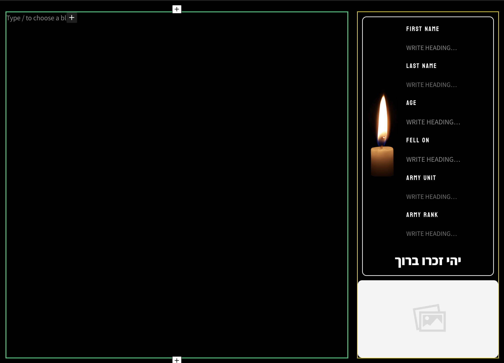

# גיבורים
מדור גיבורים מוקדש לחללי צה״ל שמסרנו את נפשם בהגנה על מדינת ישראל ועל הזכות שלנו לחיות כאן

הסיבה שאתם קוראים את הטקסט הזה היא הודות לאותם גיבורים, שהקדישו את החיים שלהם עד לנשימה האחרונה

### **להגן על הזכות שלנו לחיות פה** 🇮🇱🎗️

במדור גיבורים אנחנו מפרסמים את הסיפור של אותם גיבורים

יחד, נוכל ליצור זיכרון תמידי ברשת לכל אחד מחללי המלחמה ולספר לכולם את הסיפור שלהם

## איך לפרסם פוסט במדור גיבורים

<iframe 
  src="https://www.wizardshot.com/embed/tutorials/18107-tutorial-adding-new-hero-in-iron-swords-war-website" 
  style={{
    width: '100%', 
    height: '3600px',
    border: 'none', 
    borderRadius: '4px',
    margin: '20px 0',
  }}
/>
## אפיון הפוסט
:::note[לפני שמתחילים]
כתיבת פוסטים במדור גיבורים דורשת רגישות ודיוק גבוהה,
חשוב להקדיש את הזמן הנכון ולעשות את הפוסטים בצורה הטובה ביותר
:::

### כותרת
שם מלא של הגיבור על פי איך שהוא מופיע בפורטל הצוות שלנו

<iframe 
  src="https://www.wizardshot.com/embed/tutorials/18108-navigate-and-access-features-in-iron-swords-war-tutorial" 
  style={{
    width: '100%', 
    height: '3200px',
    border: 'none', 
    borderRadius: '4px',
    margin: '20px 0',
  }}
/>

:::danger[אזהרה]
**אין לתרגם שמות, או לנסות להתאים שמות לתרגום באנגלית! עושים שימוש במידע המפורסם לציבור באתר צה״ל בלבד**

המערכת שלנו מתעדכנת באופן ישיר מהאתר הרשמי של צה״ל
:::


### תוכן
התוכן יכיל את סיפור החיים האישי של החלל ואת המידע המפורסם עליו באתר צה״ל

לפני שאנחנו נכתוב את הפוסט נצטרך להכין את התבנית של "soldier Details" בעזרת הפקודה:
```
/soldier Details
```

בתבנית אנחנו נמלא את המידע על החלל באופו שבואו הוא מופיע באתר צה״ל
#### אופן מילוי המידע בתבנית - 🟨
* שם פרטי - שם פרטי באנגלית כפי שהוא מופיע באתר צה״ל
* שם משפחה - שם משפחה באנגלית כפי שהוא מופיע באתר צה״ל
* תאריך נפילה - תאריך נפילה באנגלית מלא. 
    לדוגמה:
    ```
    07 OCTOBER 2023
    ```
    החודש יופיע באנגלית ולא בצורה מספרית
* יחידה - היחידה שבה שירת החלל, השם של היחידה יופיע באנגלית כפי שהוא מופיע בויקיפדיה 
* דרגה - הדרגה של החלל, כפי שהיא מופיעה באתר צה״ל באנגלית
:::note[הערה]
במידה ואתם כותבים פוסט על גיבורה שנפלה במלחמה אז נשנה את הטקסט מתחת לנר הזיכרון ל:
יהי זכרה ברוך
:::
#### הסיפור האישי - 🟩
אחרי שסיימנו למלא את תבנית בצורה מושלמת אנחנו צריכים לספר על הגיבור בצורה אישית
את הסיפור שלו אפשר למצוא על ידי חיפוש מידע באינטרנט ובאתר צה״ל

אנחנו נאסוף מספר מקורות מידע ציבוריים: אתרי חדשות, בלוגים, ורשתות חברתיות

אחרי שאספנו מספר נכבד של מקורות מידע אנחנו ננסח את הפוסט בצורה יפה ומסודרת

אפשר להיעזר בבינה המלאכותית בשביל ניסוח איכותי, [לחצו כאן בשביל ללמוד עוד](https://app.clickup.com/9018603423/v/dc/8crtxwz-358)
#### תוכן נוסף - 🟩

לעיתים קרובות אפשר למצוא יוזמות של המשפחה או חברים של אותו חלל שמקדישים זמן ומאמץ לזכור את החלל

זה מגיע לידי ביטוי בעמודים אישיים ברשתות החברתיות לזיכרון

במידה ומצאנו עמוד או פרופיל לזיכרון של החלל שאנחנו כותבים עליו אז נוסיף את הרשת החברתית של החלל בסוף העמוד
בעזרת התבנית של "Soldier Social Media" בעזרת הפקודה:
```
/Soldier Social Media
```
בשביל עוד מידע קראו במדריך שימוש בתבנית "Soldier Social Media"
### הגדרות הפוסט - מנהל הפוסט שלי
#### תאריך פרסום
אנחנו משתמשים בפונקצייה של תאריך הפרסום בשביל לציין את תאריך הנפילה של החייל 

את תאריך הנפילה אנחנו נמצא בתיאור המשימה

חיילים שנפלו בשבת השחורה התאריל שלהם יהיה 07/10/2023 וההשעה תהיה 6:30 בבוקר

למדריך: [איך לשנות את תאריך הפרסום בפוסטים שלי](/starting/wordpess/date)

#### קטגוריה
המערכת שלנו מגדירה את הקטגוריה של הפוסט באופן אוטומטי למדור גיבורים
#### תגיות
התגיות לפוסט יכללו את שם היחידה הצבאית ואת העיר בה מתגורר החייל.

מידע זה זמין בפורטל הצוות שלנו. לכל חלל מצורף המידע המלא מתוך אתר צה״ל

שם העיר והיחידה ייכתבו באנגלית בהתאם לאופן בו הם מופיעים במקורות מהימנים באינטרנט, כגון ויקיפדיה.

:::note[מידע חשוב]
אתר העיר ואת היחידה יש לרשום באנגלית, אבל בשביל למצוא את הניסוח הנכון והמדוייק אנחנו
אנחנו נבצע חיפוש באינרטנט ונכתוב את המידע על פי המידע שנמצא
:::

#### תמונה
התמונה תהיה התמונה של החלל מתוך אתר צה״ל בלבד!
:::danger[אזהרה]
חל איסר מוחלט על לעשות שימוש בתמונות של חללים מכל מקור אחר
רק על פי המידע שפורסם לציבור באתר צה״ל
:::
<figure className="media">
  <div data-oembed-url="https://www.wizardshot.com/embed/tutorials/10110-">
    <div style={{ position: 'relative', height: 0, paddingBottom: '65%', pointerEvents: 'unset' }}>
      <iframe 
        src="https://www.wizardshot.com/embed/tutorials/10110-" 
        style={{ position: 'absolute', width: '100%', height: '100%', top: 0, left: 0, border: 'none', borderRadius: '4px' }}
      ></iframe>
    </div>
  </div>
</figure>


#### תקציר
תקציר יהיה סיבת הנפילה של החלל, את התקציר נכתוב באנלית

את המידע הזה אפשר למצוא בפורטל הצוות שלנו

import Tabs from '@theme/Tabs';
import TabItem from '@theme/TabItem';

<Tabs>
  <TabItem value="example1" label="דוגמא 1 - המלחמה בעזה" default>
    ```
    Fell in battle against Hamas terrorists in the southern Gaza Strip
    ```
    ```
    Fell in a battle against Hamas terrorists in the northern Gaza Strip
    ```
    ```
    Fell in a battle against Hamas terrorists in the central Gaza Strip
    ```
  </TabItem>
  <TabItem value="example2" label="דוגמא 2 - פצועים">
    ```
    Died of his wounds after being seriously injured in a mission to free hostages held by Hamas terrorists
    ```
  </TabItem>
  <TabItem value="example3" label="דוגמא 3 - הזירה הצפונית">
    ```
    Fell defending the country on the Lebanese border
    ```
    ```
    Fell in battle defending Israel’s Northern Border
    ```
  </TabItem>
  <TabItem value="example4" label="דוגמא 4 - השבת השחורה">
    ```
    Fell in battle defending the people of Sha’ar Hanegev near the city of Sderot
    ```
    ```
    Fell in a battle against Hamas terrorists, while rescuing the residents of Kibbutz Bari
    ```
    ```
    Fell in battle defending Israel against Hamas terrorists during October 7
    ```
    ```
    Fell in the battle for the defense of the Zikim base, the only base that was not captured, saved about 90 recruits who closed Shabbat and another 30 civilians who fled to the base.
    ```

  </TabItem>
</Tabs>
