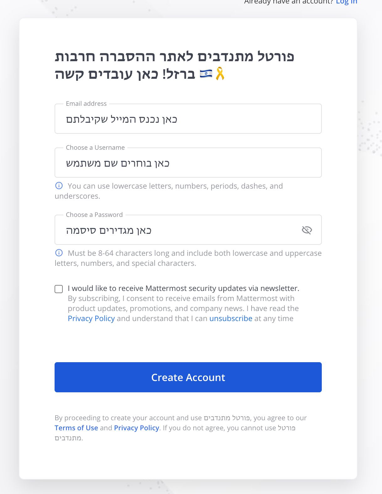
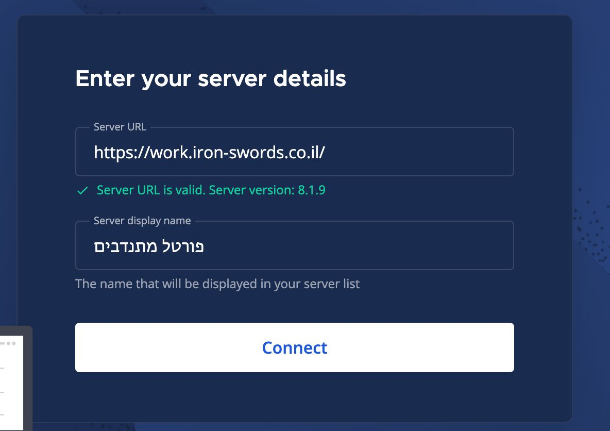

# פתיחת משתמשים חדשים

בגלל כמות המתנדבים הגדלה, החלטנו לעבור לפלטפורמת Mattermost, שתאפשר לנו לעבוד בצורה יותר אפקטיבית. Mattermost משלב בין כלים כמו Slack, Discord ו-Teams, ומציע גם מערכות לניהול משימות ותהליכים - בדיוק מה שאנחנו צריכים.

## הורדת המערכת

 ניתן להיכנס לקישור למטה ולהוריד את האפליקציות לכל פלטפורמה (מחשב, טלפון). שימו לב שהמשתמש שלכם הוא אותו משתמש כמו באתר ההסברה, אך ניתן ורצוי לשנות את הסיסמה.

[קישור להורדת האפליקציות](https://mattermost.com/pl/download-apps)

## הרשמה למערכת

### דרך אתר האינטרנט (לא באפליקציה)
1. היכנסו לקישור: [https://work.iron-swords.co.il](https://work.iron-swords.co.il)
2. בחרו בכפתור "Don't Have An Account?"
3. מלאו את הפרטים שלכם.

### דרך האפליקציה
1. פתחו את האפליקציה.
2. במסך הראשון מלאו את כתובת השרת: work.iron-swords.co.il.
3. במידת הצורך, תתבקשו למלא גם את שם השרת.

4. בחרו בכפתור "Don't Have An Account?"
5. מלאו את הפרטים שלכם.

בהצלחה!