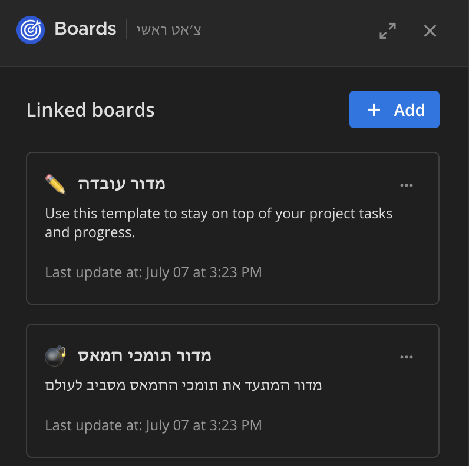

# שימוש במערכת המשימות

כדי לדעת אילו משימות צריך לבצע ואיפה ניתן לתרום, יש לנו מערכת ייעודית לניהול משימות. בצ'אט הראשי, בפינה, תוכלו למצוא את האייקון של מערכת המשימות.

:::info[טיפ]
לא ניתן לראות את מערכת המשימות בטלפון, אלא רק במחשב או באתר.
:::

על ידי לחיצה על כל אחד מהלוחות ברשימה, תוכלו להציג את התוכן שלהם.

שימוש במערכת המשימות דומה לשימוש ב-Trello או במערכות ניהול משימות אחרות.

<figure className="media">
  

    

      <iframe 
        src="https://www.wizardshot.com/embed/tutorials/10120-steps-to-comment-on-a-post-in-iron-swords-portal" 
        style={{ position: 'absolute', width: '100%', height: '100%', top: 0, left: 0, border: 'none', borderRadius: '4px' }}
      ></iframe>
    

  

</figure>