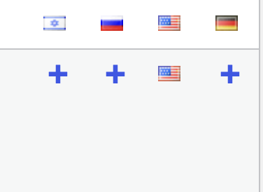

# מערכת השפות
כל אתר הסברה צריך לתמוך בכמה שפות ולא רק אנגלית, אנחנו בוחרים את השפות שלנו בהתאם למה שהמתנדבים יודעים ורוצים לעשות

## השפות באתר
- אנגלית - שפה ראשית
- עברית
- רוסית

## איך מתרגמים פוסטים?
במערכת, ליד כל פוסט יש את השפות לתרגום, אנחנו נבחר בשפה שאנחנו רוצים ונלחץ על +

אחרי זה יפתח לנו דף חדש עם הפוסט ונוכל לתרגם אותו לשפה שבחרנו

:::info[מידע חשוב]
הפוסט נפתח בלי הטקטס, ובלי כותרת, וכל התוכן יהיה ריק

אנחנו נכנסים לפוסט המקורי בחלונית חדשה ומתרגמים את התוכן

### **חשוב** לעקוב אחרי המדריכים שלנו של [סוגי התוכן](/category/%D7%A1%D7%95%D7%92%D7%99-%D7%AA%D7%95%D7%9B%D7%9F)

:::