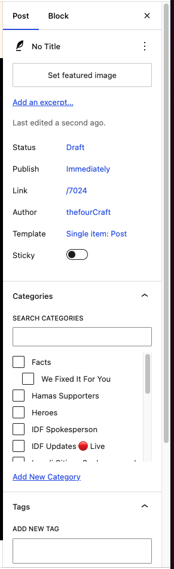
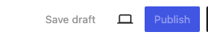

# מבנה הפוסט
האתר שלנו נועד להתמודד אם תוכן, אבל גם לא רצינו להמציא את הגלגל מחדש
לכן בחרנו במערכת ניהול תוכן מקצועית בשם wordpress 
למבנה של wordpress יש כמה חלקים עיקריים, ובמדריך הזה אנחנו נעבור על מבנה הפוסט
:::note[חשוב לדעת]
ההסבר פה הוא מותאם במיוחד בשביל אתר ההסברה שלנו, הליך הפרסום ומבנה הפוסט יכול להשתנות

האתר שלנו עבר התאמה בשביל לעזור למתנדבים לפרסם פוסטים בצורה מהירה ויעילה
:::

## כותרת
הכותרת היא החלק הראשון של הפוסט, והיא תמיד תהיה בגודל גדול יותר משאר הטקסט
בשביל להוסיף כותרת יש ללחוץ על הכפתור "Add Title" בחלק העליון של המבנה
המערכת מתאימה את הגודל והנראות של הכותרת בהתאם לסוג התוכן של הפוסט

## תוכן
תוכן הפוסט הוא בעצם החלק מתחת לכותרת, וזה החלק שבו נמצא התוכן של הפוסט
בתוך תוכן הפוסט ניתן להוסיף כל סוג של תוכן, כמו תמונות, וידאו, קישורים ועוד
הפלטפורמה שלנו משתמש בתבניות תוכן מוכנות מראש שמעצבות את עולמות התוכן השונים באתר

ברוב הפעמים אנחנו נמשוך תבנית אחת לסוג פוסט אחד ונשנה את התוכן בהתאם לצורך
שאר תוכן הפוסט יהיה טקסט
### משיכת תבנית
בשביל למשוך תבנית מהמערכת אנחנו נלחץ על החלק מתחת לכותרת של הפוסט
ונקליד את שם התבנית בצירוף /
דוגמא:
```
/soldier details
```
הדוגמא הזאת מושכת את התבנית של מדור הגיבורים בפלטפורמה - לזכרם של הנופלים במלחמת חרבות ברזל
:::info[טיפ]
חשוב לשים לב שכאשר אנחנו מושכים טקסט מופיע על המסך "Type / to choose a block"
:::
### כתיבת טקסט
אחרי שהגדרנו כותרת לפוסט שלנו, אנחנו נכנסים לתוך תוכן הפוסט
בשביל להתחיל לכתוב כל מה שצריך לעשות זה ללחוץ מתחת לכותרת אם העכבר ולהתחיל לכתוב
הפלטפורמה מתאימה את גודל הטקסט והצבע בהתאם לנושא הפוסט שלכם
## מנהל הפוסט שלי
כאשר פותחים פוסט באתר ניתן לראות בחלק הימני של המסך את כל האפשרויות של הפוסט


או כמו שאנחנו קוראים לזה - מנהל הפוסט שלי

מנהל הפוסט מחולק לחמש חלקים עיקריים:
- Featured Image
  ### הסבר על Featured Image
  בתוך החלק של Featured Image אפשר למצוא את התמונה הראשית של הפוסט
  כאן אפשר להעלות תמונה מהמחשב שלכם או לבחור תמונה מהגלריה של האתר
  התמונה הראשית של הפוסט תוצג בכל מקום שבו הפוסט יופיע
  בכל סוג פוסט יהיה הסבר מיוחד על אופן ההעלאה של התמונה בהתאם לסוג הפוסט
- Excerpt
- Status
- Publish
- Categories
- Tags


### הסבר על Categories
בתוך החלק של Categories אפשר למצוא את הקטגוריות שבהן הפוסט יופיע
כאן אפשר לבחור כמה קטגוריות שבהן הפוסט יופיע
:::danger[אזהרה]
חשוב מאוד לבחור קטגוריות נכונות כי זה יקבע את הקהל שבו הפוסט יופיע

חלק מהפוסטים במידה ויגיעו למקום הלא נכון יכולים לעורר תגובות שליליות חמורות מאוד

**נא לשים לב איפו מפרסמים את הפוסט**
:::
### הסבר על Tags
בתוך החלק של Tags אפשר למצוא את התגים שבהם הפוסט יופיע
כאן אפשר לבחור כמה תגים שבהם הפוסט יופיע
התגים עוזרים למיין את התוכן לעולמות קטנים יותר ולהפוך את הפוסט לנגיש יותר
ובעתיד הקרוב יהיה להם משמעות עמוקה יותר
בכל סוג פוסט יהיה הסבר מיוחד על אופן התיוג של הפוסט

### הסבר על Excerpt
בתוך החלק של Excerpt אפשר למצוא את התקציר של הפוסט
התקציר הוא חלק קצר מהפוסט שמציג את הפוסט בצורה קצרה ומרכזית
התקציר יוצג בכל מקום שבו הפוסט יופיע
בכל סוג פוסט יהיה הסבר מיוחד על אופן הכתיבה של התקציר בהתאם לסוג הפוסט

## הפאנל העליון
בחלק העליון בצד ימין של המסך ניתן למצוא את הכפתורים העיקריים של מערכת פרסום הפוסט



- Save Draft - כאן אפשר לשמור את הפוסט כטיוטה
- Publish - כאן אפשר לפרסם את הפוסט
  :::info[טיפ]
  כאשר אתם מפרסמים את הפוסט המערכת תעשה סיכום של הפעולות שלכם
  
  ובמקרה ותפספסו להוסיף קטגוריה, תמונה ראשית או תג תמיד תוכלו לחזור ולתקן
  :::