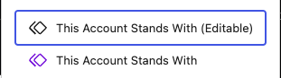

# תומך חמאס
פוסט של תומך חמאס לוקח פרופיל של בוט או אדם אמיתי ומסביר לקוראים על מה הפוסט מדבר

הפוסטים של תומכי חמאס באתר מקבלים את הכי הרבה ביקורים בגלל שלרוב הם הרבה יותר מפורסמים

בגלל שהאתר שלנו מתמקד על קידום איכותי בגוגל וכך לרוב אנחנו מגיעים לחמישייה הפותחת

## אפיון הפוסט
### כותרת
הכותרת של הפוסט תהיה השם המלא של תומך החמאס או שם הארגון או שם החשבון
### תוכן
התוכן של הפוסט פשוט יכנה את הישות בתור תומך חמאס ויסביר מה הישות עושה בשביל לקדם נרטיב של תמיכה בחמאס
אחרי שנסיים לכתוב אנחנו נוסיף את התבנית של "This Account Stands With"  בעזרת הפקודה:
```
/this account stands with
```

#### הפקודה הזאת מציגה 2 תבניות



- **This Account Stands With:**

   התבנית הזו היא תבנית מוכנה אם כל ארגוני הטרור הפועלים כנגד ישראל במלחמת חרבות ברזל
   לרוב תומכי חמאס גם תומכים בארגונים אחרים כמו חיזבאללה וכו'
- **This Account Stands With (Editable):**

    התבנית הזו היא תבנית דומה לקודמת אבל ניתן לשנות את הטקסט של התבנית כך שהיא תתאים לכל סוג של תומך חמאס
    בתבנית הזאת אפשר לשנות את הכותרת ולהסיר דגלים של ארגונים אחרים במידת הצורך

    ##### איך מסירים דגלים?
    1. סימול הדגל בעזרת העכבר
    2. לחיצה על הדגל
    3. שלוש נקודות בצד ימין
    4. Delete (אם אתם רואים + ריק זה אומר שהדגל נמחק)

    ##### איך משנים כותרת?
    1. לחיצה על הכותרת
    2. שינוי הכותרת

### הגדרות הפוסט - מנהל הפוסט שלי
Categories: Hamas Supporters

    

