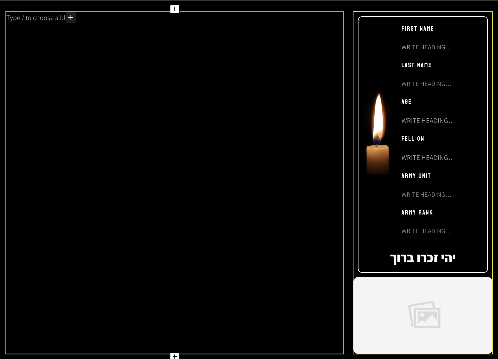

# גיבורים
מדור גיבורים מוקדם לחללי צה״ל שמסרנו את נפשם בהגנה על מדינת ישראל ועל הזכות שלנו לחיות כאן

הסיבה שאתם קוראים את הטקסט הזה היא הודות לאותם גיבורים, שהקדישו את החיים שלהם עד לנשימה האחרונה

### **להגן על הזכות שלנו לחיות פה** 🇮🇱🎗️

במדור גיבורים אנחנו מפרסמים את הסיפור של אותם גיבורים

יחד, נוכל ליצור זיכרון תמידי ברשת לכל אחד מחללי המלחמה ולספר לכולם את הסיפור שלהם

## אפיון הפוסט
:::note[לפני שמתחילים]
כתיבת פוסטים במדור גיבורים דורשת רגישות ודיוק גבוהה,
חשוב להקדיש את הזמן הנכון ולעשות את הפוסטים בצורה הטובה ביותר
:::

איך לדעת על מי לכתוב? [קרא כאן](/learn/app/task-heroes)
### כותרת
שם מלא של הגיבור על פי איך שהוא מופיע באתר צה״ל
:::danger[אזהרה]
**אין לתרגם שמות, או לנסות להתאים שמות לתרגום באנגלית! עושים שימוש במידע המפורסם לציבור באתר צה״ל בלבד**
:::

#### איך מוצאים את השם?
1. [נכנסים לאתר צה״ל](https://www.idf.il/%D7%A0%D7%95%D7%A4%D7%9C%D7%99%D7%9D/%D7%97%D7%9C%D7%9C%D7%99-%D7%94%D7%9E%D7%9C%D7%97%D7%9E%D7%94/)
2. מחפשים את השם של החלל בעברית
3. פותחים את העמוד האישי של החלל באתר
4. מעתיקים את השם המלא של החלל כפי שהוא מופיע באתר באנגלית
5. מדביקים את השם בכותרת
   
<figure className="media">
  <div data-oembed-url="https://www.wizardshot.com/embed/tutorials/10109-navigate-through-idf-website-to-access-personal-page">
    <div style={{ position: 'relative', height: 0, paddingBottom: '65%', pointerEvents: 'unset' }}>
      <iframe 
        src="https://www.wizardshot.com/embed/tutorials/10109-navigate-through-idf-website-to-access-personal-page" 
        style={{ position: 'absolute', width: '100%', height: '100%', top: 0, left: 0, border: 'none', borderRadius: '4px' }}
      ></iframe>
    </div>
  </div>
</figure>
### תוכן
התוכן יכיל את סיפור החיים האישי של החלל ואת המידע המפורסם עליו באתר צה״ל

לפני שאנחנו נכתוב את הפוסט נצטרך להכין את התבנית של "soldier Details" בעזרת הפקודה:
```
/soldier Details
```

בתבנית אנחנו נמלא את המידע על החלל באופו שבואו הוא מופיע באתר צה״ל
#### אופן מילוי המידע בתבנית - 🟨
* שם פרטי - שם פרטי באנגלית כפי שהוא מופיע באתר צה״ל
* שם משפחה - שם משפחה באנגלית כפי שהוא מופיע באתר צה״ל
* תאריך נפילה - תאריך נפילה באנגלית מלא. 
    לדוגמה:
    ```
    07 OCTOBER 2023
    ```
    החודש יופיע באנגלית ולא בצורה מספרית
* יחידה - היחידה שבה שירת החלל, השם של היחידה יופיע באנגלית כפי שהוא מופיע בויקיפדיה 
* דרגה - הדרגה של החלל, כפי שהיא מופיעה באתר צה״ל באנגלית
:::note[הערה]
במידה ואתם כותבים פוסט על גיבורה שנפלה במלחמה אז נשנה את הטקסט מתחת לנר הזיכרון ל:
יהי זכרה ברוך
:::
#### הסיפור האישי - 🟩
אחרי שסיימנו למלא את תבנית בצורה מושלמת אנחנו צריכים לספר על הגיבור בצורה אישית
את הסיפור שלו אפשר למצוא על ידי חיפוש מידע באינטרנט ובאתר צה״ל

אנחנו נאסוף מספר מקורות מידע ציבוריים: אתרי חדשות, בלוגים, ורשתות חברתיות

אחרי שאספנו מספר נכבד של מקורות מידע אנחנו ננסח את הפוסט בצורה יפה ומסודרת

#### תוכן נוסף - 🟩

לעיתים קרובות אפשר למצוא יוזמות של המשפחה או חברים של אותו חלל שמקדישים זמן ומאמץ לזכור את החלל

זה מגיע לידי ביטוי בעמודים אישיים ברשתות החברתיות לזיכרון

במידה ומצאנו עמוד או פרופיל לזיכרון של החלל שאנחנו כותבים עליו אז נוסיף את הרשת החברתית של החלל בסוף העמוד
בעזרת התבנית של "Soldier Social Media" בעזרת הפקודה:
```
/Soldier Social Media
```
בשביל עוד מידע קראו במדריך שימוש בתבנית "Soldier Social Media"
### הגדרות הפוסט - מנהל הפוסט שלי
#### תאריך פרסום
אנחנו משתמשים בפונקצייה של תאריך הפרסום בשביל לציין את תאריך הנפילה של החייל 

את תאריך הנפילה אנחנו נמצא בעמוד האישי של החלל באתר צה״ל

חיילים שנפלו בשבת השחורה התאריל שלהם יהיה 07/10/2023 וההשעה תהיה 6:30 בבוקר

<figure className="media">
  <div data-oembed-url="https://www.wizardshot.com/embed/tutorials/10856-steps-for-accessing-idf-website-and-posting-content-on-iron-swords-war-website">
    <div style={{ position: 'relative', height: 0, paddingBottom: '65%', pointerEvents: 'unset' }}>
      <iframe 
        src="https://www.wizardshot.com/embed/tutorials/10856-steps-for-accessing-idf-website-and-posting-content-on-iron-swords-war-website" 
        style={{ position: 'absolute', width: '100%', height: '100%', top: 0, left: 0, border: 'none', borderRadius: '4px' }}
      ></iframe>
    </div>
  </div>
</figure>

#### קטגוריה
אנחנו נבחר בקטגוריה "Heroes"
#### תגיות
התגיות בפוסט יהיו היחידה של החלל והעיר שהוא גר בה

את המידע הזה ניתן למצוא באתר צה״ל או בגליון הנתונים שלנו

את שם העיר והיחידה נכתוב באנגלית על פי איך שהן מופיעות באינטרנט
##### איך מוצאים את העיר והיחידה?
<figure className="media">
  <div data-oembed-url="https://www.wizardshot.com/embed/tutorials/10857-navigate-idf-website-to-access-specific-military-units">
    <div style={{ position: 'relative', height: 0, paddingBottom: '65%', pointerEvents: 'unset' }}>
      <iframe 
        src="https://www.wizardshot.com/embed/tutorials/10857-navigate-idf-website-to-access-specific-military-units" 
        style={{ position: 'absolute', width: '100%', height: '100%', top: 0, left: 0, border: 'none', borderRadius: '4px' }}
      ></iframe>
    </div>
  </div>
</figure>

:::note[מידע חשוב]
אתר העיר ואת היחידה יש לרשום באנגלית, אבל בשביל למצוא את הניסוח הנכון והמדוייק אנחנו
אנחנו נבצע חיפוש באינרטנט ונכתוב את המידע על פי המידע שנמצא
:::

#### תמונה
התמונה תהיה התמונה של החלל מתוך אתר צה״ל בלבד!
:::danger[אזהרה]
חל איסר מוחלט על לעשות שימוש בתמונות של חללים מכל מקור אחר
רק על פי המידע שפורסם לציבור באתר צה״ל
:::
<figure className="media">
  <div data-oembed-url="https://www.wizardshot.com/embed/tutorials/10110-">
    <div style={{ position: 'relative', height: 0, paddingBottom: '65%', pointerEvents: 'unset' }}>
      <iframe 
        src="https://www.wizardshot.com/embed/tutorials/10110-" 
        style={{ position: 'absolute', width: '100%', height: '100%', top: 0, left: 0, border: 'none', borderRadius: '4px' }}
      ></iframe>
    </div>
  </div>
</figure>
#### תקציר
תקציר יהיה סיבת הנפילה של החלל, את התקציר נכתוב באנלית

את המידע הזה גם אפשר למצוא באתר צה״ל בעמוד האישי של החלל
דוגמאות לתקציר:
```
Fell in battle against Hamas terrorists in the southern Gaza Strip
Died of his wounds after being seriously injured in a mission to free hostages held by Hamas terrorists
Fell defending the country on the Lebanese border
```
חשוב להדגיש את המילים Hamas terrorists כי צה״ל נלחם בחמאס ולא בתושבי עזה
