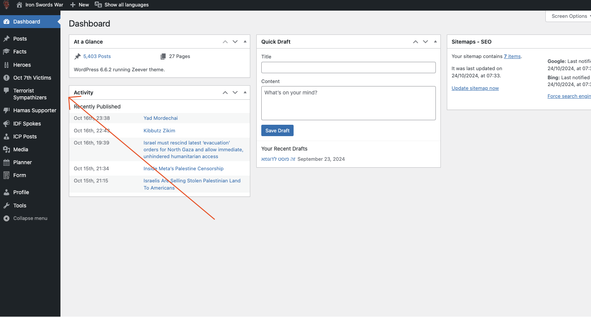
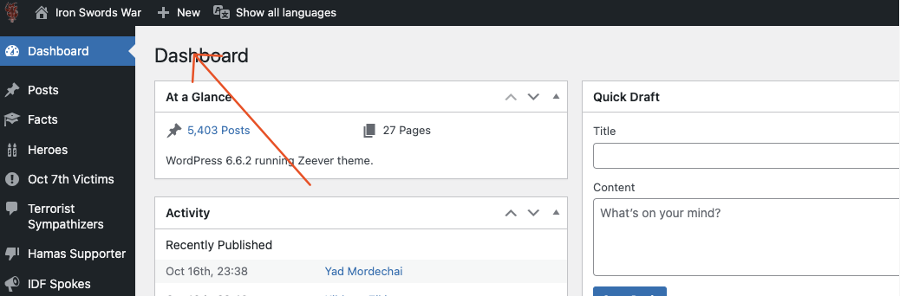
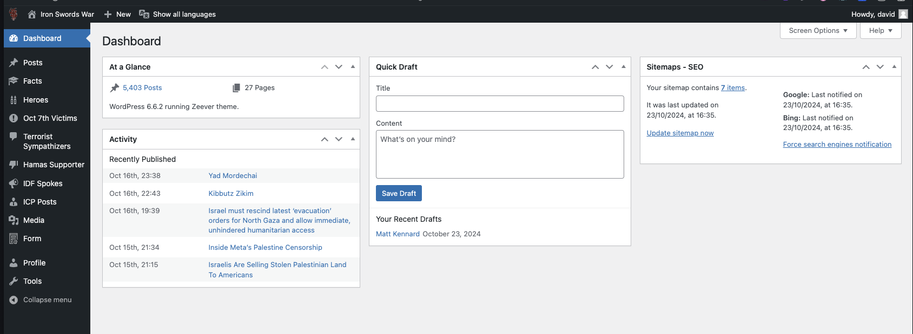
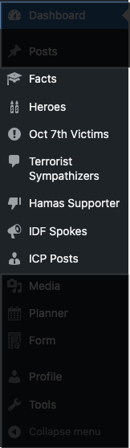
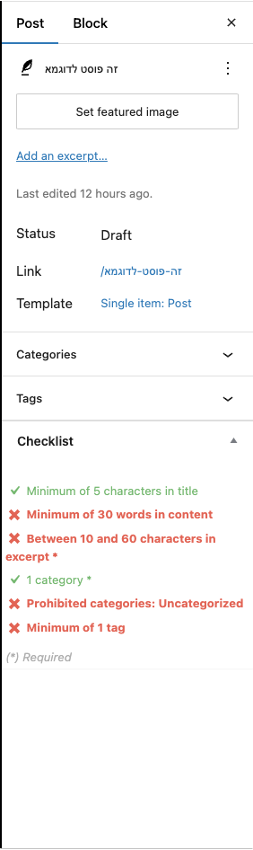
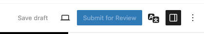

# וורדפרס
## מתחילים עם וורדפרס

וורדפרס זה מערכת ניהול תוכן, כלומר מערכת שמאפשרת לנו לנהל תוכן באתר בצורה נוחה ופשוטה. וורדפרס נחשבת לאחת מהמערכות הפופולריות ביותר בעולם ומשמשת כיום עשרות מיליוני אתרים ברחבי העולם. (43.5% מכל האתרים בעולם נבנו בעזרת וורדפרס)

## המבנה

:::note[חשוב לדעת]
ההסבר פה הוא מותאם במיוחד בשביל אתר ההסברה שלנו.
האתר שלנו עבר התאמה בשביל לעזור למתנדבים לפרסם פוסטים בצורה מהירה ויעילה.
:::

בצעד שמאל אפשר לראות את תפריט הניווט הכללי של האתר. בתפריט הזה ניתן למצוא את כל הפעולות העיקריות שניתן לבצע באתר כמו פרסום פוסטים, עריכת פרטים אישיים ועוד.

למעלה מהתפריט ניתן לראות את הלוגו של האתר ואת הכותרת שלו, ולבצע פעולות מהירות כמו פרסום פוסט חדשות או שינוי התצוגה של הפוסטים לפי השפות שאתר ההסברה שלנו תומך בהן.

בתמונה הזאת אנחנו עומדים על ״דף הבית״ את הדף הזה אנחנו נראה אחרי שנתחבר לאתרֿ, הדף הזה מספק מידע על מה קורה באתר.

בתפריט מצעד שמאל, אפשר לזהות את סוגי התוכן שאנחנו עושים הסברה עליהם

## פס הניווט
- [Dashboard](https://iron-swords.co.il/wp-admin/index.php)
- Posts (כל הפוסטים שפורסמו באתר)
  - All Posts
  - Add New (הוספת פוסט חדש)
- [Facts](https://iron-swords.co.il/wp-admin/admin.php?page=facts-posts) (מדור עובדה)
  - All Facts
  - Add New Fact
- [Heroes](https://iron-swords.co.il/wp-admin/admin.php?page=heroes-posts) (מדור גיבורים)
  - All Heroes
  - Add New Hero
- [Oct 7th Victims](https://iron-swords.co.il/wp-admin/admin.php?page=massacre-victims-posts) (מדור נרצחי השבת השחורה)
  - All Victims
  - Add New Victim
- [Terrorist Sympathizers](https://iron-swords.co.il/wp-admin/admin.php?page=terrorist-sympathizers-posts) (מדור אוהבי המחבלים)
  - All Terrorist Sympathizers
  - Add New Sympathizer
- [Hamas Supporters](https://iron-swords.co.il/wp-admin/admin.php?page=hamas-supporters-posts) (מדור תומכי חמאס)
  - All Hamas Supporters
  - Add New Hamas Supporter
- [IDF Spokes](https://iron-swords.co.il/wp-admin/admin.php?page=idf-spokesperson-posts) (מדור עדכוני דו״צ)
  - All IDF Spokesman Posts
  - Add New IDF Spokesman Post
- [ICP Posts](https://iron-swords.co.il/wp-admin/admin.php?page=israeli-citizen-spokesperson-posts) (מדור לשכת הדוברות האזרחית)
  - All Israeli Citizen Spokespersons Posts
  - Add New Israeli Citizen Spokespersons Post
- [Media](https://iron-swords.co.il/wp-admin/upload.php)
- Planner
  - Content Calendar
  - Content Board
- [Profile](https://iron-swords.co.il/wp-admin/profile.php)

## בונה הפוסט
אומנם בונה הפוסטים/הדפים נראה יחסית מסובך אבל אנחנו צריכים להתרכז ב 2 חלקים 
מנהל הפוסט שלי, תוכן
### [תוכן הפוסט](starting/wordpess/post-layout)
בכל פוסט אנחנו צריכים להגדיר כותרת - אותה אנחנו נעשה בהתאם לסוג התוכן שאנחנו רושמים עליו
מתחת לכותרת נוכל להגדיר את התוכן של הפוסט - אנחנו נפעל תמיד בהתאם לסוג התוכן שאנחנו רושמים עליו
### [מנהל הפוסט שלי](/starting/wordpess/post/)
[מנהל הפוסט שלי](/starting/wordpess/post/), נמצא בצעד ימין של בונה הפוסט/דף והוא חלק מאוד עיקרי בכתיבת הפוסטים שלנו

## פס עליון

בפס העליון יש את כפתורי השליטה העיקריים של הפוסט
- Save Draft - שמירת טיוטה
- View - שינוי התצוגה של הפוסט (בשביל לראות כייפית כיצד הפוסט יראה בטלפון/טאבלט/מחשב)
- Submit for Review - שליחה לבדיקה
- Checklist - מערכת בדיקה אוטומטית של הפוסט
- Languages - מערכת השפות של האתר

## מדריכים נוספים
import DocCardList from '@theme/DocCardList';

<DocCardList />