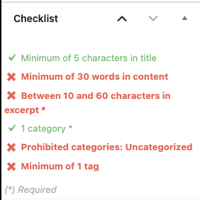

# Checklist
מערכת הבדיקות האוטומטית עוזרת לכם לוודא כי הפוסט מוגדר בצורה הטובה ביותר לפני שהוא יפורסם.

המערכת בודקת דרישות מינמליות לפוסט, חלק מהדרישות הן חובה וחלקן מומלצות.

בנוסף אפשר למצא את הבדיקות של הפוסט לא רק במנהל הפוסט שליֿֿֿ, אלה גם בכפתור Checklists שבתפריט העליון של עורך הפוסט.

